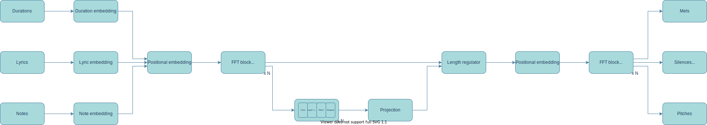

# HiFiSinger

This code is an unofficial implementation of HiFiSinger. The algorithm is based on the following papers:

```
Chen, J., Tan, X., Luan, J., Qin, T., & Liu, T. Y. (2020). HiFiSinger: Towards High-Fidelity Neural Singing Voice Synthesis. arXiv preprint arXiv:2009.01776.
Ren, Y., Ruan, Y., Tan, X., Qin, T., Zhao, S., Zhao, Z., & Liu, T. Y. (2019). Fastspeech: Fast, robust and controllable text to speech. Advances in Neural Information Processing Systems, 32, 3171-3180.
Yamamoto, R., Song, E., & Kim, J. M. (2020, May). Parallel WaveGAN: A fast waveform generation model based on generative adversarial networks with multi-resolution spectrogram. In ICASSP 2020-2020 IEEE International Conference on Acoustics, Speech and Signal Processing (ICASSP) (pp. 6199-6203). IEEE.
```

# Requirements
Please see the 'requirements.txt'.


# Structure

## Generator


* In training, length regulator use target duration.

## Discriminator


* HiFiSinger uses Sub Frequency GAN(SF-GAN).
* The frequency range of sampling is fixed and length range is randomized.


# Used dataset
* Code verification was conducted through a limited-sized, private Korean dataset.
    * Thus, current [Pattern_Generator.py](Pattern_Generator.py) and [Datasets.py](Datasets.py) are based on the Korean.
* Please report the information about any available open source dataset.
    * The set of midi files with syncronized lyric and high resolution vocal wave files


# Hyper parameters
Before proceeding, please set the pattern, inference, and checkpoint paths in 'Hyper_Parameters.yaml' according to your environment.

* Sound
    * Setting basic sound parameters.

* Tokens
    * The number of Lyric token.

* Max_Note
    * The highest note value for embedding.

* Min/Max duration
    * Mel length which model use.
    * Min duration is used at pattern generating only.

* Encoder
    * Setting the encoder.

* Duration_Predictor
    * Setting for duration predictor

* Decoder
    * Setting for decoder.

* Discriminator
    * Setting for discriminator
    * In frequency range, frequency is the index of mel dimension.
        * The index must be equal or less than Sould.Mel_Dim.

* Vocoder_Path
    * Setting the traced vocoder path.
    * To generate this, please check [Here](https://github.com/CODEJIN/PWGAN_for_HiFiSinger)

* Train
    * Setting the parameters of training.

* Use_Mixed_Precision
    * Setting mix precision usage.
    * Need a [Nvidia-Apex](https://github.com/NVIDIA/apex).

* Inference_Batch_Size
    * Setting the batch size when inference

* Inference_Path
    * Setting the inference path

* Checkpoint_Path
    * Setting the checkpoint path

* Log_Path
    * Setting the tensorboard log path

* Device
    * Setting which GPU device is used in multi-GPU enviornment.
    * Or, if using only CPU, please set '-1'. (But, I don't recommend while training.)

# Generate pattern

* There is no available open source dataset.
    
# Inference file path while training for verification.

* Inference_for_Training
    * There are two examples for inference.
    * It is midi file based script.

# Run

## Command
```
python Train.py -s <int>
```

* `-hp <path>`
    * The hyper paramter file path
    *  This is required.

* `-s <int>`
    * The resume step parameter.
    * Default is 0.
